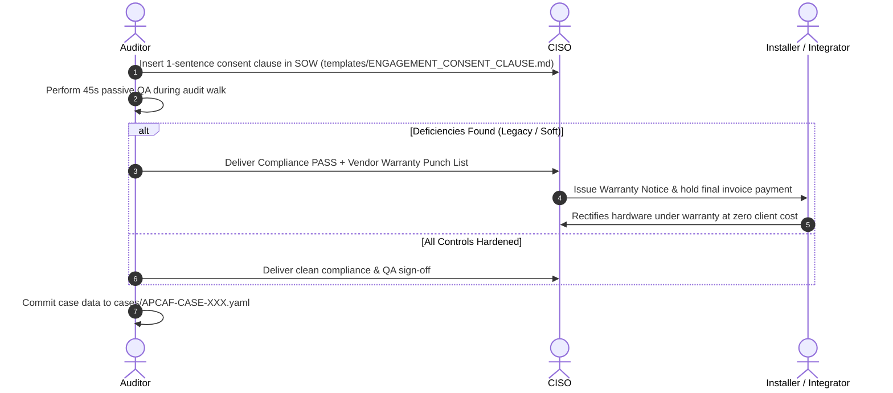

# APCAF - Adversarial Physical Control Assessment Framework
### *The MITRE ATT&CK® for Physical & Hardware-Layer Security*

[](LICENSE)
[](docs/TAXONOMY.md)
[](VENDOR_QA_SCORECARD.md)

**APCAF (Adversarial Physical Control Assessment Framework)** is an open physical security evaluation standard inspired by MITRE ATT&CK®. It evaluates whether physical security controls actually resist real-world attacker bypasses, rather than just verifying their paper existence.

---

## 1. Architectural Foundation: Learning from MITRE ATT&CK

MITRE ATT&CK transformed cybersecurity by creating a **standardized, vendor-agnostic language** for cyber adversary behavior. APCAF brings that exact structural rigor to physical security:

```
┌────────────────────────────────────────────────────────────────────────────────────────┐
│                              APCAF TAXONOMY ARCHITECTURE                               │
├────────────────────────────────────────────────────────────────────────────────────────┤
│ 1. Tactics (PHY-TAC-01..05)    ──> The Adversary's Spatial/Access Goal                 │
│ 2. Techniques (PHY-T1001..T1031)──> The Physical/Hardware Bypass Mechanism              │
│ 3. Passive QA Spec (45s MVP)   ──> Non-invasive, deterministic hardware verification   │
│ 4. Mitigations (PHY-M1001..M1004)──> Contractually enforceable warranty engineering     │
│ 5. Compliance Cross-Walk       ──> Mapped to ISO 27001 (A.7/A.8), PCI DSS v4 (Req 9)   │
└────────────────────────────────────────────────────────────────────────────────────────┘
```

Detailed architectural specifications and taxonomy mapping are in [`docs/TAXONOMY.md`](docs/TAXONOMY.md).

---

## 2. The Core 5 Physical Tactics Matrix

| Tactic | Objective | Active MVP Techniques |
| :--- | :--- | :--- |
| **`PHY-TAC-01: Perimeter`** | Breaching outermost fence/gates/turnstiles | *Planned (Post-MVP)* |
| **`PHY-TAC-02: Credential`** | Harvesting, cloning, or relaying badge tokens | **`PHY-T1001` (Unencrypted RFID Harvesting)** |
| **`PHY-TAC-03: Portal Ingress`** | Defeating doors, latches, and exit sensors | **`PHY-T1002` (Latch Slip) & `PHY-T1003` (REX Trip)** |
| **`PHY-TAC-04: Containment`** | Bypassing server racks, cages, and vaults | *Planned (Post-MVP)* |
| **`PHY-TAC-05: Interface/Tap`** | Tapping exposed network drops or serial lines | **`PHY-T1004` (Unauthenticated L1/L2 Port Tap)** |

---

## 3. The 45-Second Fast-Path Field Scorecard

The core MVP implements the 3 highest-leverage techniques across the physical kill-chain:

| APCAF ID | Technique | Passive QA Inspection Method (Zero Liability) | Hardened Standard | Legacy / Soft Indicator |
| :--- | :--- | :--- | :--- | :--- |
| **`APCAF-01`** | **`PHY-T1001`** | **5s:** Contactless pocket RFID reader read | AES-128 / DESFire EV3 / Seos | 125 kHz Prox / MIFARE Classic |
| **`APCAF-02`** | **`PHY-T1002 / T1003`** | **30s:** Visual & gap feeler measurement | Continuous Astragal + Shrouded REX PIR | Exposed latch bolt / unhooded REX |
| **`APCAF-03`** | **`PHY-T1004`** | **10s:** Passive zero-packet LED plug test | Zero Link Pulse / 802.1X Auth | Active L1/L2 link state on open drop |

Detailed operational instructions: [`VENDOR_QA_SCORECARD.md`](VENDOR_QA_SCORECARD.md).

---

## 4. Repository Structure

```
APCAF/
├── README.md                          # Framework architecture, philosophy & standard
├── VENDOR_QA_SCORECARD.md             # One-pager fast-path inspection reference manual
├── docs/
│   └── TAXONOMY.md                    # Formal MITRE-aligned physical security taxonomy
├── schemas/
│   └── case.schema.json               # JSON Schema for standardized audit case logs
├── templates/
│   ├── ENGAGEMENT_CONSENT_CLAUSE.md   # Fast-path SOW & legal authorization addendums
│   └── VENDOR_WARRANTY_NOTICE.md      # Executive CISO invoice-hold & punch list notice
├── cases/
│   └── APCAF-CASE-001.yaml            # Validated field case tracking record
└── tools/
    └── field-triage.html              # Offline-first zero-dependency interactive triage app
```

---

## 5. Field Triage & CISO Deliverable Generator

Open [`tools/field-triage.html`](tools/field-triage.html) in any browser (offline-capable):
* **Visual Matrix:** Displays the full MITRE-aligned physical security tactics.
* **30-Second Evaluation:** Toggle Hardened vs. Legacy/Soft states with observed field notes.
* **Instant CISO Punch List:** Automatically outputs a formatted **Vendor Warranty Non-Conformance Notice**.
* **STIX/YAML Export:** Exports structured case logs ready to commit to [`cases/`](cases/).

---

## 6. Real-World Execution Path


