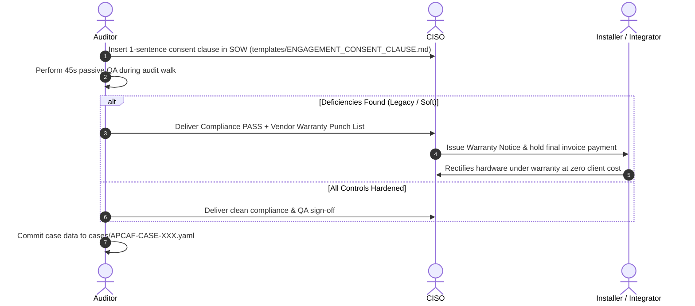

# APCAF - Adversarial Physical Control Assessment Framework
### *An ATT&CK-Inspired Open Framework for Adversarial Physical-Control Assessment*

[](LICENSE)
[](LICENSE)
[](docs/TAXONOMY.md)
[](VENDOR_QA_SCORECARD.md)

**APCAF (Adversarial Physical Control Assessment Framework)** is an open physical security evaluation standard inspired by the behavioral taxonomy principles of MITRE ATT&CK®. It evaluates whether physical security controls actually resist real-world adversary bypass techniques under passive inspection, rather than just verifying their paper existence.

---

## ⚡ What is APCAF in Plain English? (The 60-Second Mental Model)

APCAF is a way to check whether physical security controls can actually resist common attacker bypasses. 

Instead of asking only *"Is there a lock on the door?"*, APCAF asks **"How could someone bypass this lock, and does the current setup resist that?"**

### The 5-Step Evaluation Pipeline
```
[01. TACTIC]      --> The Goal: What is the attacker trying to achieve? (e.g. Portal Ingress: get through the door)
      │
[02. TECHNIQUE]   --> The Mechanism: What bypass path could they use? (e.g. Latch Slip: manipulate latch via gap)
      │
[03. OBSERVATION] --> The Check: What physical condition enables this? (e.g. Feeler gauge gap > 3.2mm, no astragal)
      │
[04. ASSESSMENT]  --> The Status: Is the hardware hardened or susceptible? (e.g. Legacy / Soft Defect)
      │
[05. REMEDIATION] --> The Fix: How is it closed at $0 client capex? (e.g. GC installs steel astragal under warranty)
```

### 🗺️ Choose Your Pathway
* **[1. Learn it (Interactive Field Guide)](https://zoecyber001.github.io/APCAF/learn.html)** — A 6-lesson practical introduction with an interactive facility simulator.
* **[2. Use it (45s Field Triage)](https://zoecyber001.github.io/APCAF/#workbench)** — Non-invasive physical security evaluation with automated CISO warranty notices.
* **[3. Study it (Technical Standard)](https://zoecyber001.github.io/APCAF/docs.html)** — Full taxonomy matrix, NFPA 80 building codes, and Atomic Red Team YAML test specs.

---

## 1. Architectural Foundation: Learning from MITRE ATT&CK

MITRE ATT&CK transformed cybersecurity by creating a **standardized, vendor-agnostic language** for cyber adversary behavior. APCAF applies similar structural principles to physical security, establishing a standardized language for adversarial physical-control assessment:

```
┌────────────────────────────────────────────────────────────────────────────────────────┐
│                              APCAF TAXONOMY ARCHITECTURE                               │
├────────────────────────────────────────────────────────────────────────────────────────┤
│ 1. Tactics (PHY-TAC-01..05)    ──> The Adversary's Spatial/Access Goal                 │
│ 2. Techniques (PHY-T1001..T1031)──> The Physical/Hardware Bypass Mechanism              │
│ 3. Passive QA Spec (45s MVP)   ──> Non-invasive, deterministic hardware verification   │
│ 4. Mitigations (PHY-M1001..M1004)──> Contractually enforceable warranty engineering     │
│ 5. Compliance Cross-Walk       ──> Mapped to ISO 27001 (A.7/A.8), PCI DSS v4 (Req 9)   │
└────────────────────────────────────────────────────────────────────────────────────────┘
```

Detailed architectural specifications and taxonomy mapping are in [`docs/TAXONOMY.md`](docs/TAXONOMY.md).

---

## 2. The Core 5 Physical Tactics Matrix

| Tactic | Objective | Active MVP Techniques |
| :--- | :--- | :--- |
| **`PHY-TAC-01: Perimeter`** | Breaching outermost fence/gates/turnstiles | *Planned (Post-MVP)* |
| **`PHY-TAC-02: Credential`** | Harvesting, cloning, or relaying badge tokens | **`PHY-T1001` (Unencrypted RFID Harvesting)** |
| **`PHY-TAC-03: Portal Ingress`** | Defeating doors, latches, and exit sensors | **`PHY-T1002` (Latch Slip - NFPA 80 §6.3.1.7.1) & `PHY-T1003` (REX Trip)** |
| **`PHY-TAC-04: Containment`** | Bypassing server racks, cages, and vaults | *Planned (Post-MVP)* |
| **`PHY-TAC-05: Interface/Tap`** | Tapping exposed network drops or serial lines | **`PHY-T1004` (Unauthenticated L1/L2 Port Tap)** |

---

## 3. The 45-Second Fast-Path Field Scorecard

The core MVP implements the 3 highest-leverage techniques across the physical kill-chain:

| APCAF ID | Technique | Passive Non-Invasive Inspection Method | Hardened Standard | Building / Fire Code Citation |
| :--- | :--- | :--- | :--- | :--- |
| **`APCAF-01`** | **`PHY-T1001`** | **5s:** Contactless pocket RFID reader read | AES-128 / DESFire EV3 / Seos | ISO/IEC 14443-4, NIST SP 800-116 |
| **`APCAF-02`** | **`PHY-T1002 / T1003`** | **30s:** Visual & feeler gap measurement | Continuous Astragal + Shrouded REX PIR | **NFPA 80 §6.3.1.7.1 (Max 3.2mm)**, ANSI/SDI A250.8 |
| **`APCAF-03`** | **`PHY-T1004`** | **10s:** Passive zero-packet LED plug test | Zero Link Pulse / 802.1X Auth | IEEE 802.1X-2020, NIST SP 800-53 PE-3 |

Detailed operational instructions: [`VENDOR_QA_SCORECARD.md`](VENDOR_QA_SCORECARD.md).

---

## 4. Repository Structure

```
APCAF/
├── README.md                          # Framework architecture, philosophy & standard
├── CONTRIBUTING.md                    # Contribution guidelines & technique YAML schema
├── LICENSE                            # Dual license (CC BY 4.0 for spec, MIT for tooling)
├── VENDOR_QA_SCORECARD.md             # One-pager fast-path inspection reference manual
├── docs/
│   └── TAXONOMY.md                    # Formal MITRE-aligned physical security taxonomy
├── schemas/
│   └── case.schema.json               # JSON Schema for standardized audit case logs
├── templates/
│   ├── ENGAGEMENT_CONSENT_CLAUSE.md   # Fast-path SOW & legal authorization addendums
│   └── VENDOR_WARRANTY_NOTICE.md      # Executive CISO invoice-hold & punch list notice
├── cases/
│   └── APCAF-CASE-001.yaml            # Validated field commissioning case tracking record
└── tools/
    └── field-triage.html              # Offline-first zero-dependency interactive triage app
```

---

## 5. Governance & Community Contributions

APCAF is developed and maintained by the **APCAF Working Group** as an open, vendor-neutral standard:
* **Submissions:** Community researchers can propose new `PHY-Txxxx` techniques via GitHub PRs following [`CONTRIBUTING.md`](CONTRIBUTING.md).
* **Licensing:** The written standard and taxonomy are licensed under **Creative Commons Attribution 4.0 International (CC BY 4.0)**. Assessment tools and code are licensed under **MIT**.
* **Contact & Inquiries:** [GitHub Issues & Discussions](https://github.com/zoecyber001/APCAF/issues)

---

## 6. Real-World Execution Path


