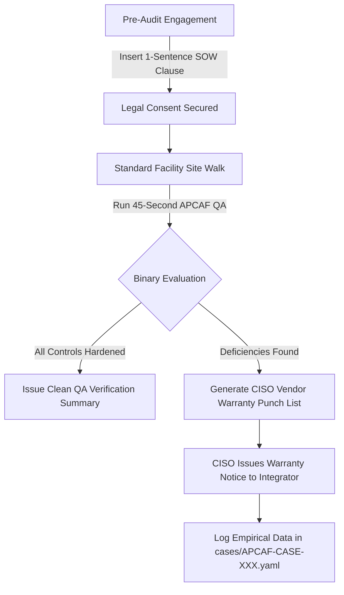

# APCAF - Vendor Installation QA Scorecard & Technical Reference Manual

**Document ID:** `APCAF-DOC-001`  
**Classification:** Operational Security Engineering Standard (MVP)  
**Methodology:** Non-Invasive Passive Specification Verification  
**Total Field Inspection Time:** ~45 Seconds per Core Access Vector  

---

## 1. Operational Persona & Philosophy

Traditional compliance audits (ISO 27001, PCI DSS, SOC 2, NDPA) verify the *presence* of physical controls. APCAF verifies the *engineering specification* of physical controls.

```
                    ┌────────────────────────────────────────────────────────┐
                    │               TRADITIONAL AUDIT vs. APCAF              │
                    ├────────────────────────────┬───────────────────────────┤
                    │ Traditional Checklist      │ APCAF QA Layer            │
                    ├────────────────────────────┼───────────────────────────┤
                    │ • "Is card reader active?" │ • "Is credential AES-128?"│
                    │ • "Does door close?"       │ • "Is latch gap guarded?" │
                    │ • "Are ports documented?"  │ • "Is Layer 1 disabled?"  │
                    │                            │                           │
                    │ Output: Regulatory PASS    │ Output: CISO Punch List   │
                    │ (Satisfies Auditor)        │ (Leverages Vendor Retain) │
                    └────────────────────────────┴───────────────────────────┘
```

---

## 2. Technical Inspection Protocol & Decision Trees

### Control APCAF-01: RF Credential Modernity
* **Inspection Objective:** Identify whether badge architecture relies on unauthenticated, cloneable UID/Facility Code transmission.
* **Tooling:** Pocket Multi-Frequency RFID/NFC Reader / Pocket Badge Interrogator.
* **Field Time:** $\le 5\text{ seconds}$.
* **Non-Invasive Safety Boundary:** Passive read only. No credential duplication, no replay attack, no reader brute-forcing.

```
                                [PASSIVE RF BADGE READ]
                                           │
                        ┌──────────────────┴──────────────────┐
                        ▼                                     ▼
                [125 kHz Carrier]                     [13.56 MHz Carrier]
                        │                                     │
                        ▼                              ┌──────┴──────┐
                 LEGACY / SOFT                         ▼             ▼
              (EM4100 / HID Prox /             [MIFARE Classic]  [DESFire / Seos / PKI]
              Indala / AWID / Kantech)                 │             │
                                                       ▼             ▼
                                                 LEGACY / SOFT    HARDENED
                                                  (CSN-Only)     (AES-128 / EV3)
```

* **HARDENED Criteria:** ISO/IEC 14443-4 or ISO/IEC 7816 smartcards operating with encrypted application containers (MIFARE DESFire EV2/EV3, HID Seos, PIV/CAC PKI).
* **LEGACY / SOFT Criteria:** 125 kHz low-frequency proximity tokens or 13.56 MHz unencrypted UID/CSN reads (MIFARE Classic 1K/4K with default keys).

---

### Control APCAF-02: Server Room Perimeter Hardening
* **Inspection Objective:** Verify door perimeter construction prevents mechanical latch slips, under-door manipulation, or REX PIR sensor tripping through gaps.
* **Tooling:** Visual line-of-sight check & metric gap gauge / feeler blade.
* **Field Time:** $\le 30\text{ seconds}$.
* **Non-Invasive Safety Boundary:** External inspection only. Do not depress crash bars, do not touch fire alarm hardware, zero tool insertion.

```
                           [DOOR PERIMETER INSPECTION]
                                       │
                  ┌────────────────────┴────────────────────┐
                  ▼                                         ▼
        [Outward-Swinging Door]                   [Inward-Swinging Door]
                  │                                         │
        ┌─────────┴─────────┐                     ┌─────────┴─────────┐
        ▼                   ▼                     ▼                   ▼
 [Exposed Latch Bolt  [Continuous Astragal  [Perimeter Gap     [Sealed Frame &
  Gap > 3.2mm (1/8")]  Plate Installed]     Exposes REX PIR]    Deflector Shroud]
        │                   │                     │                   │
        ▼                   ▼                     ▼                   ▼
  LEGACY / SOFT          HARDENED           LEGACY / SOFT          HARDENED
```

* **HARDENED Criteria:** Outward-opening security doors feature continuous, full-height steel astragal latch guards. Inward-opening doors have tight frame margins ($\le 3.2\text{mm}$) with interior Request-to-Exit (REX) passive infrared (PIR) sensors enclosed in directional beam shrouds/collars.
* **LEGACY / SOFT Criteria:** Exposed latch bolt accessible via jamb gap; direct line-of-sight to interior REX PIR sensor from the threshold.

---

### Control APCAF-03: Exposed Port Signal State
* **Inspection Objective:** Determine whether accessible Ethernet jacks in unmonitored zones provide active network link states without authentication.
* **Tooling:** Passive LED Ethernet Continuity / Link-State Dongle (Zero-packet physical tester).
* **Field Time:** $\le 10\text{ seconds}$.
* **Non-Invasive Safety Boundary:** Non-packet-transmitting LED load test only. No DHCP requests, no ARP requests, no IP packet capture or traffic sniffing.

```
                            [EXPOSED RJ-45 WALL DROP]
                                       │
                        [Insert Passive LED Tester]
                                       │
                        ┌──────────────┴──────────────┐
                        ▼                             ▼
              [No LED Activity]             [Link-State LED On]
              (Port Hard-Disabled                 (Active PHY Link)
              or Isolated Drop)                       │
                        │                       ┌─────┴─────┐
                        ▼                       ▼           ▼
                     HARDENED              [Open / No NAC] [802.1X Auth]
                                                │           │
                                                ▼           ▼
                                          LEGACY / SOFT  HARDENED
```

* **HARDENED Criteria:** Jack is unpatched at cross-connect, switch port is administratively `shutdown`, or documented 802.1X quarantine is confirmed via independent authorized testing.
* **LEGACY / SOFT Criteria:** Layer 1 PHY carrier link indicator LED illuminates continuously on unmonitored common-area drop.

---

## 3. Fast-Path Inspection Reference Table

| Control ID | Vector | Inspection Method | Field Time | Hardened Standard | Legacy / Soft Indicator |
| :--- | :--- | :--- | :--- | :--- | :--- |
| **APCAF-01** | Credential Modernity | Pocket RFID Interrogation | 5s | AES-128 / DESFire EV2/EV3 / Seos / PKI | 125 kHz Prox / EM4100 / MIFARE Classic |
| **APCAF-02** | Perimeter Hardening | Visual & Gap Measurement | 30s | Continuous Astragal + Shrouded REX PIR | Exposed latch bolt (gap > 3.2mm) / Unshrouded REX |
| **APCAF-03** | Exposed Port State | Passive LED Plug Test | 10s | Zero PHY Link / Port Disabled / 802.1X | Active L1 PHY link state on unmonitored drop |

---

## 4. Operational Playbook for Assessors



1. **Step 1 - Legal Baseline:** Integrate [`templates/ENGAGEMENT_CONSENT_CLAUSE.md`](templates/ENGAGEMENT_CONSENT_CLAUSE.md) into engagement terms.
2. **Step 2 - Field Execution:** Execute the 3 checks in 45 seconds during the physical walk.
3. **Step 3 - Deliverable Packaging:**
   * Compliance / Commissioning Records: Objective non-conformance telemetry.
   * CISO / Client Leadership: [`templates/VENDOR_WARRANTY_NOTICE.md`](templates/VENDOR_WARRANTY_NOTICE.md) containing the punch list.
4. **Step 4 - Case Archival:** Commit field logs to [`cases/`](cases/) validated against [`schemas/case.schema.json`](schemas/case.schema.json).
